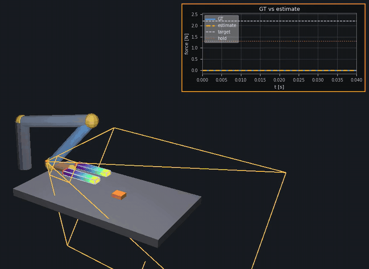
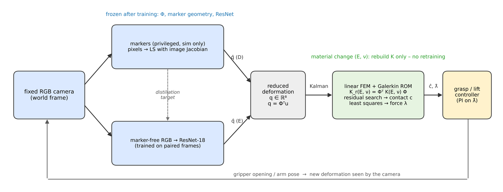

# Compliant Finger: Vision → Deformation → Physics → Force

**Estimating contact force and contact location on a soft robotic finger from a single fixed RGB camera — by learning *geometry* from pixels and leaving force to an interpretable mechanics model.**

```
camera image  →  reduced deformation q ∈ ℝ⁸  →  FEM / Galerkin ROM  →  contact location ĉ, contact force λ̂
```

## Main contributions

1. **Learn deformation, not force.** The network predicts only an 8-D deformation state $q = \Phi^\top u$ and never sees a force label.
2. **Marker-free vision.** Markers are used only during training. At test time a ResNet-18 reads plain RGB and localises contact to 1.2 mm (markers: 18.6 mm).
3. **Physics after the network.** An 8 × 8 reduced FEM model turns $q$ into contact location and force.
4. **No retraining for new materials.** Changing $E$ or $\nu$ only requires rebuilding $K$, and the closed-loop grasp lifts the object at every tested stiffness.
5. **Camera-only closed-loop grasping.** A 7-DoF arm lifts an object using force feedback from a single fixed camera.

## Demo

<p align="center">
  
</p>

**Stage E, marker-free closed loop** (`python scripts/run_arm_grasp.py --mode nn --video`).
The arm squeezes and lifts the orange box. The FEM finger is coloured by displacement;
the orange frustum is the fixed observation camera, whose view is in the inset.
The plot compares the ground-truth contact force (blue) with the estimate from
camera → ResNet-18 → $q$ → ROM (orange, causal EMA for display; ground truth is never used).
In this run the raw median force error is 25.6 % and the contact error 3.2 mm, and the object is lifted.

<p align="center">
  
</p>

## Quick start

```bash
conda env create -f environment.yml
conda activate compliant_finger
pip install -e .                                   # optional; scripts also run from the repo root

python scripts/run_arm_grasp.py --mode world       # Stage D: world camera + markers
python scripts/run_arm_grasp.py --mode nn          # Stage E: same camera, marker-free ResNet-18
python scripts/run_material_sweep.py               # material generalisation (paper Fig. 5)
python -m pytest                                   # tests
```

Stage E needs a trained checkpoint (about 1 min of data generation plus about 10 min of training on an
M-series GPU); see [docs/DETAILS.md](docs/DETAILS.md#grasp-stages-a--b--c--d--e).
Large datasets (`data/processed/`) and checkpoints (`*.pt`) are not tracked in git
and are regenerated by the scripts.

## Repository layout

```
src/
  geometry/       finger mesh: 20-node hexahedra + 10-node tetrahedra at the tip
  fem/            linear-elastic FEM, quadratic elements, ties, body force
  rom/            POD basis Φ, Galerkin reduced mechanics
  contact/        contact operator B(c), inverse force, observation operator H
  vision/         markers, image Jacobian, ResNet-18 → q, temporal filters
  grasp/          two-finger squeeze, 7-DoF arm, estimator, controller
  rendering/      synthetic observation camera (off-screen Taichi GGUI)
  visualization/  interactive Taichi 3D viewer
  evaluation/     end-to-end pipeline, unknown-contact search, material sweep
scripts/          experiments, dataset generation, training, figures
configs/          YAML configs
results/          paper figures (figure1/, figure2/, figure5/) and summary.txt
docs/DETAILS.md   full research log: verification tables, ablations, every milestone
```

## Method

**1. Linear-elastic FEM.** The finger is clamped at its root. A normal point contact of
magnitude $\lambda$ at surface point $c$ and the finger's self-weight give

```math
K(E,\nu)\,u = B(c)\,d(c)\,\lambda + f_g, \qquad d(c) = -n(c),
\qquad K = \sum_e \sum_g w_g\, B_g^\top C(E,\nu)\, B_g \,|J_g| .
```

Hanging nodes at the hex|tet interface are tied by $u = T\tilde u$, so the solve uses
$\tilde K = T^\top K T$. Because the model is linear, every state superposes as
$u = u_c(\lambda) + u_g(R)$, where $u_g = K^{-1} f_g$ is the known sag for flange orientation $R$.

**2. Reduced-order model.** POD of contact-sweep snapshots $U = [u^1 \dots u^s]$
gives $\Phi \in \mathbb{R}^{3N \times r}$ with $r = 8$:

```math
q = \Phi^\top u, \qquad K_r = \Phi^\top K \Phi, \qquad B_r(c) = \Phi^\top B(c),
\qquad g_r(c) = K_r^{-1} B_r(c)\, d(c) \in \mathbb{R}^r .
```

**3. Force at a known contact** (displacement-space least squares):

```math
\hat\lambda = \arg\min_{\lambda \ge 0} \lVert g_r(c)\,\lambda - \hat q \rVert^2
= \max\!\left(0,\ \frac{g_r(c)^\top \hat q}{g_r(c)^\top g_r(c)}\right).
```

**4. Unknown contact location.** Residual search over candidate points on the grasp face,
weighting only the leading $r_\text{loc}$ modes, where the contact shape lives. This is followed by
barycentric refinement and a force re-fit with the unweighted $g_r$:

```math
(\hat c, \hat\lambda) = \arg\min_{c,\ \lambda \ge 0} \big\lVert W \big(g_r(c)\,\lambda - \hat q\big) \big\rVert,
\qquad W = \mathrm{diag}(\underbrace{1,\dots,1}_{r_\text{loc}}, 0, \dots, 0).
```

**5a. q from markers (Stage D).** Markers ride on the surface,
$p_k(u) = \sum_i w_{ki}(x_i + u_i)$, and are projected by the calibrated camera $\pi$.
The pixel motion is linear in $q$ through the image Jacobian:

```math
\Delta uv \approx J\,q, \quad J = \frac{\partial\, \pi\big(p(\Phi q)\big)}{\partial q}\Big|_{q=0},
\qquad \hat q = \arg\min_q \lVert \Delta uv - J q \rVert^2 + \alpha \lVert q \rVert^2 .
```

**5b. q from pixels (Stage E).** A ResNet-18 $f_\theta$ maps the marker-free RGB image $I$ to
normalised modes. It is supervised with the exact simulated contact state
$q^\text{sim} = \Phi^\top u_c$, with optional per-mode weights $w_k$:

```math
\mathcal{L}(\theta) = \frac{1}{r} \sum_{k=1}^{r} w_k \left( f_\theta(I)_k - \frac{q^\text{sim}_k - \mu_k}{\sigma_k} \right)^2 .
```

**6. Material change.** For a homogeneous isotropic finger $K(E,\nu) = E\,\bar K(\nu)$.
Rebuilding $K_r$ and $g_r$ is all that is needed. A stale model built at $E_0$ instead returns

```math
\hat\lambda_\text{stale} = \frac{E_0}{E}\,\lambda
\quad\Longrightarrow\quad
\text{relative error} = \left| \frac{E_0}{E} - 1 \right| .
```

**7. Closed loop.** $\hat q$ is Kalman-filtered. Once five consecutive localisations agree within 15 mm,
the contact is locked, and $(\hat c, \hat\lambda)$ drive a PI controller on the gripper opening.
The object lifts when the two frictional contacts beat its weight:

```math
2\,\mu\,\lambda \ \ge\ m\,g .
```

## Limitations

Simulation only: synthetic renders, with no real camera and no sim-to-real transfer yet.
The model is linear, quasi-static, homogeneous and isotropic, with one finger geometry and
a normal point contact on one face. The marker-free network was trained at a single material
$E_0$, so its force error grows far from $E_0$ even though contact localisation stays at the
millimetre level. On a soft object it reads the jaw opening as a shortcut
(see [docs/DETAILS.md](docs/DETAILS.md#deformable-object-lumped-spring-stage-h1)).

## More

- [docs/DETAILS.md](docs/DETAILS.md): the complete research log, covering FEM verification against
  Euler–Bernoulli and Timoshenko, inverse-force robustness, ROM rank sweeps, camera SNR studies,
  ablations, and the Korean and English paper summaries.
- [results/summary.txt](results/summary.txt): paper storyline and where every number comes from.
